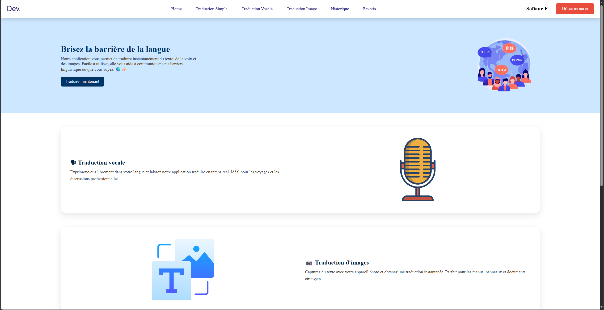
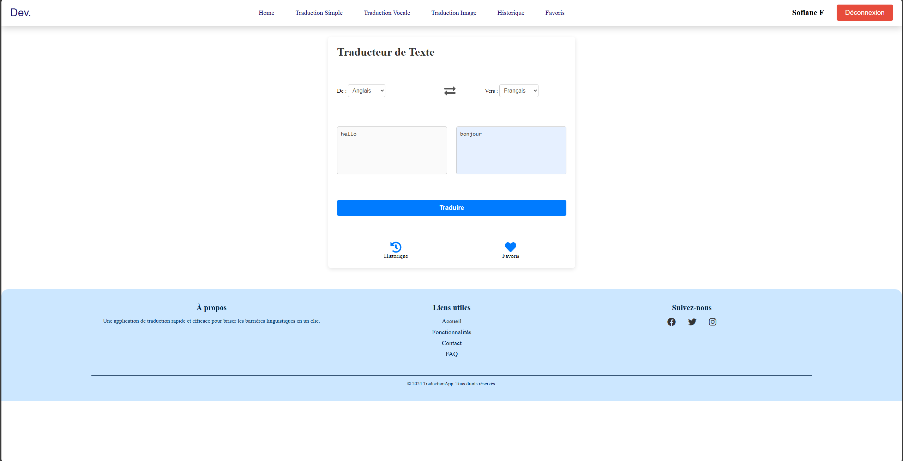
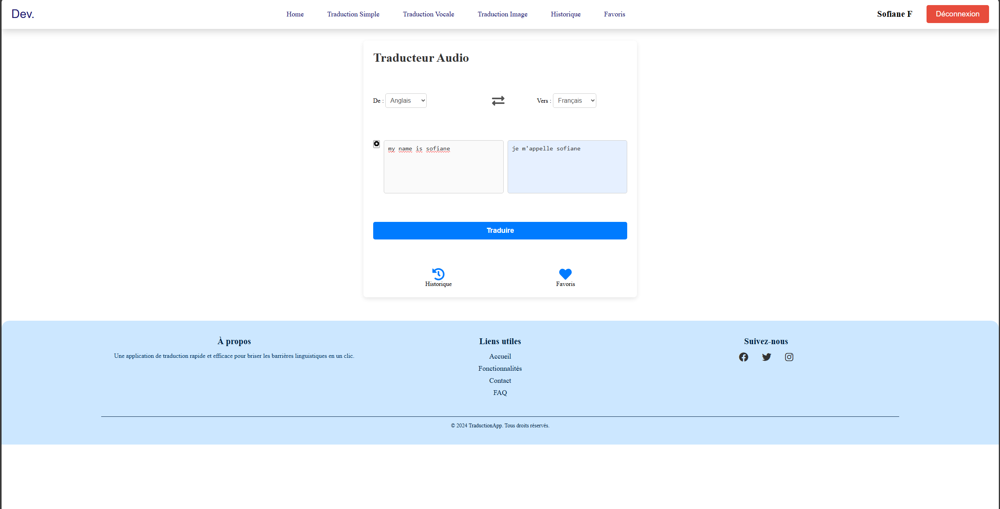
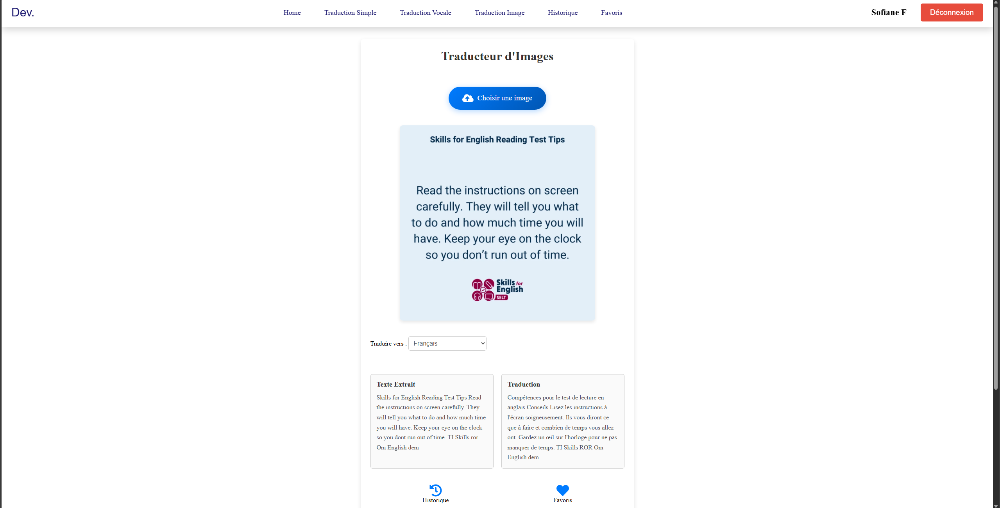
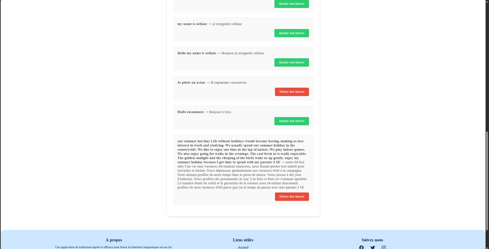
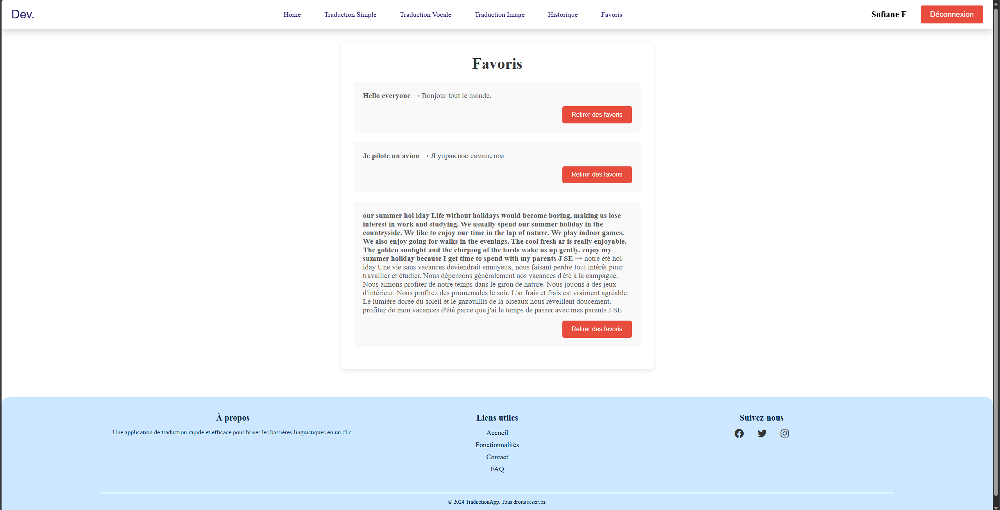

# 🌍 TraductionApp

**TraductionApp** est une application de traduction moderne et complète pour briser les barrières linguistiques. Elle permet de traduire du texte, de la voix et des images en temps réel, avec gestion des historiques et favoris pour chaque utilisateur.

---

## 🚀 Fonctionnalités

- 🔤 **Traduction Texte à Texte**  
  Traduisez instantanément du texte entre plusieurs langues.

- 🎙️ **Traduction Vocale**  
  Parlez dans votre langue, l’application vous répond dans une autre.

- 🖼️ **Traduction d’Images**  
  Envoyez une image contenant du texte, recevez sa traduction automatiquement.

- 📜 **Historique personnalisé**  
  Chaque utilisateur peut consulter ses traductions passées.

- ❤️ **Favoris**  
  Ajoutez les traductions importantes à vos favoris pour les retrouver facilement.

---

## 🖼️ Aperçu de l'application

### Accueil  

### Traduction Texte à Texte  

### Traduction Vocale  

### Traduction d’image  

### Historique  

### Favoris  

---

## 🧠 Technologies utilisées

- **React** – Interface utilisateur dynamique  
- **Firebase** – Authentification, base de données et hébergement  
- **Tailwind CSS** – Design responsive  
- **OCR/API** – Pour la traduction d’images

---

## 🔐 Authentification

Connexion obligatoire pour accéder aux favoris et à l’historique, avec stockage sécurisé via Firebase.

---

## 📅 Date de finalisation

🗓️ **26 mars 2025**

---

## 🧑‍💻 Auteur

**Sofiane Ferhaoui**  
Projet personnel React + Firebase
